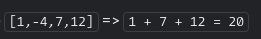

# Instruction

You get an array of numbers, return the sum of all of the positives ones.

Example 

Note: if there is nothing to sum, the sum is default to 0.

[Link](https://www.codewars.com/kata/5715eaedb436cf5606000381/train/go) for this codewar challenge if you want to give it a go yourself!